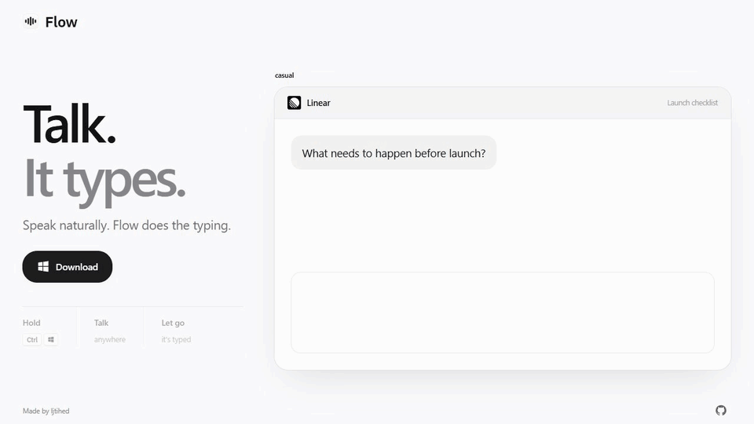
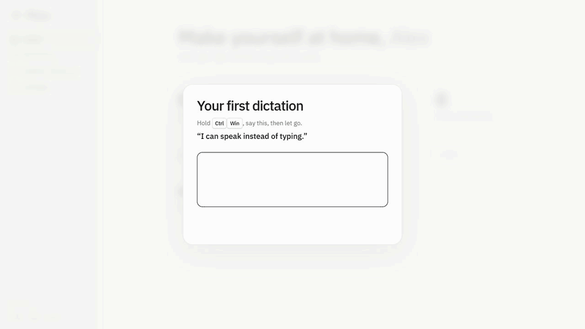

<div align="center">


# Flow

**Talk. It types.**

Free, open-source voice dictation for Windows and Linux.

[Download for Windows](https://github.com/Ijtihed/flow-local/releases/latest/download/FlowSetup.exe) · [Download for Linux](https://github.com/Ijtihed/flow-local/releases/latest/download/Flow-x86_64.AppImage) · [Website](https://ijtihed.github.io/flow-local/)

[](https://github.com/Ijtihed/flow-local/actions/workflows/ci.yml)
[](LICENSE)



<sub>Illustrative product demo with example text.</sub>

</div>

---

Hold **Ctrl + Win**, speak, and let go. Flow pastes your words where you're typing. On Linux, use **Ctrl + Super**.

## Get started

1. Download and install Flow. On Linux, make the AppImage executable with `chmod +x Flow-x86_64.AppImage`, then open it.
2. Choose your name, languages and speech engine. Setup downloads your selected local model and recommends one based on available memory.
3. Try your first dictation in the empty practice box. Then use Flow in your everyday apps.

Windows 10/11 x64 and Linux x86_64. Local speech runs on CPU; an NVIDIA GPU can speed it up. Linux X11 is supported; Wayland support is experimental. [Platform notes](docs/PLATFORMS.md)

**Windows downloads are unsigned.** SmartScreen may show an “unrecognized app” or “Unknown publisher” warning. Check that your download came from this repository; checksums accompany every new release. [Download and update details](docs/USAGE.md#downloads-and-updates)

## What makes it Flow

- **Your engine.** Run Whisper locally, or connect a compatible transcription API with your own key.
- **Your words.** Teach it names and jargon; correct a dictation to teach the spelling.
- **Your writing style.** Formal emails, casual chats, and spoken shortcuts for text you repeat.
- **Your apps.** Dictate wherever your system can paste text, with 74 familiar app identities and icons.
- **Your assistant.** Configure Flow and extend it through MCP. Copy a connection config from Settings. [MCP guide](docs/MCP.md)

<details>
<summary>Watch the first dictation</summary>



This preview uses a timed example backend. The app requires the actual recognized phrase before Continue appears.

</details>

## Privacy

Local speech stays on your computer. Optional API speech sends each recording to your chosen provider after you accept the data notice; the provider's policy and fees apply. Flow does not upload history, dictionaries or notes to that API. Cleanup and optional Obsidian vocabulary learning run locally.

No Flow account is required. Your preferred name, history and vocabulary stay in your local profile. [Speech engines and data](docs/USAGE.md#speech-engines)

## Build and contribute

```bash
git clone https://github.com/Ijtihed/flow-local.git
cd flow-local
python -m venv .venv
```

On Windows: `.venv\Scripts\pip install -r requirements.txt`, then `.venv\Scripts\python main.py`.

On Linux: install the [system dependencies](docs/PLATFORMS.md#source-install), then use `.venv/bin/pip install -r requirements.txt` and `.venv/bin/python main.py`.

[Development and tests](docs/DEVELOPMENT.md) · [Contributing](CONTRIBUTING.md) · [Report a bug](https://github.com/Ijtihed/flow-local/issues) · [Security](SECURITY.md)

## Credits

Made by [Ijtihed](https://github.com/Ijtihed). Speech uses [faster-whisper](https://github.com/SYSTRAN/faster-whisper); optional local cleanup uses [Ollama](https://ollama.com). Bundled fonts include their licenses. App logos belong to their publishers; [sources and attribution](assets/logos/SOURCES.txt).

[MIT license](LICENSE).
